#  Práctica 4: PHPMYADMIN
## Instal·lació de PhpMyAdmin
Instalamos phpadmin
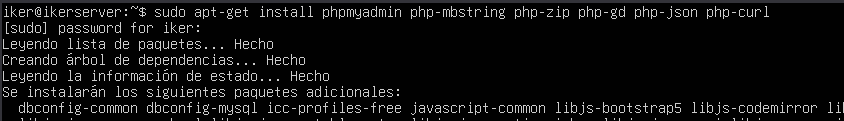

Añadimos contraseña para phpmyadmin
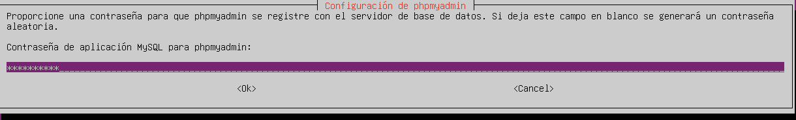

Crearemos un enlace simbolico para que nginx pueda acceder a phpMyAdmin
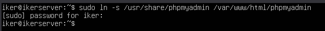

Ahora comprobamos que funcione.

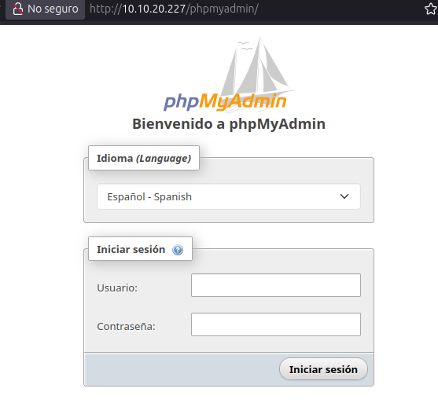

## Permitir acceso por contraseña del root de MySQL
Ahora entraremos a MySQL y añadiremos lo siguiente para permitir acceso por contraseña.

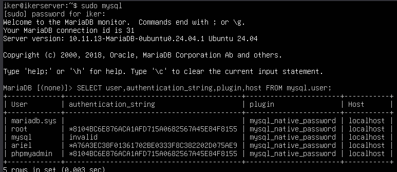

## Configuración de acceso por contraseña para un usuario dedicado de MySQL
Creamos un usuario nuevo.

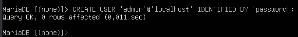

Le damos privilegios y aplicamos cambios.

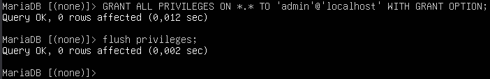

Y ahora comprobamos.

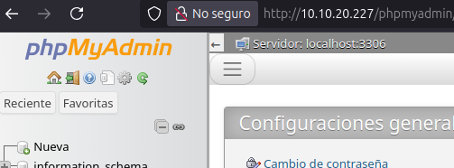

## Asegura la instancia de PHPMyAdmin
Creamos un fichero .htpasswd para almacenar credenciales usuarios y contraseñas.

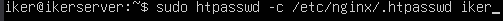

Ahora lo añadimos a la configuración.

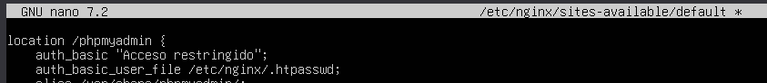

Ahora volvemos a acceder a la página y nos pedirá contraseña.

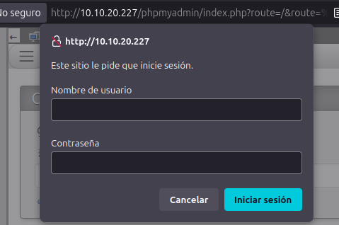

